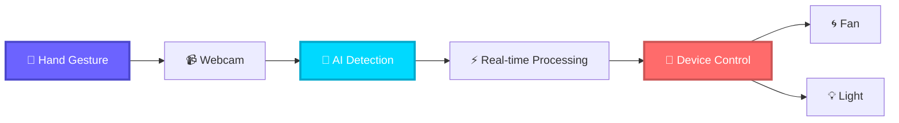
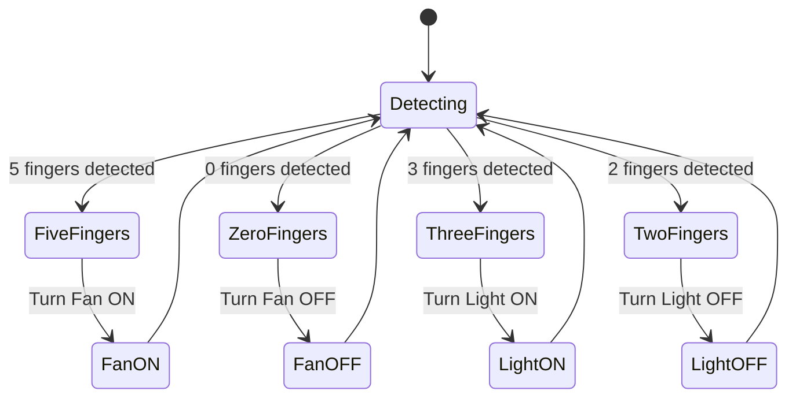
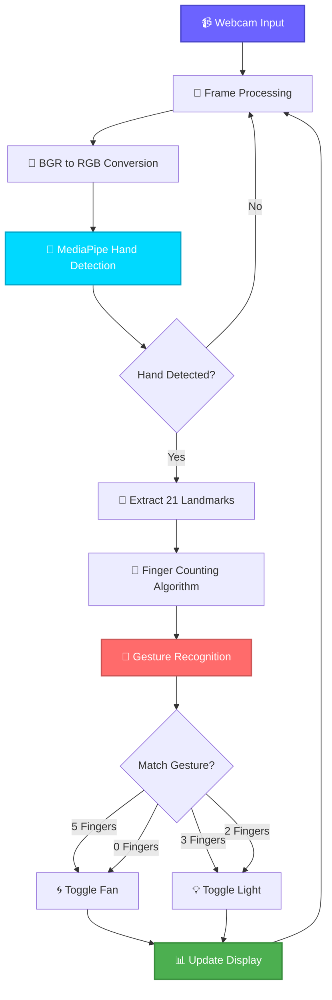
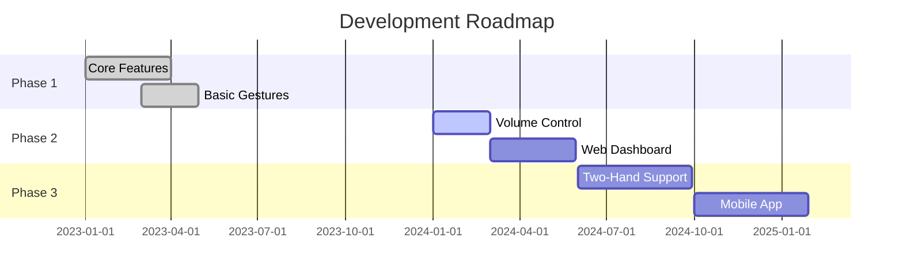

<div align="center">

# 🌟 Hand Gesture Control System 

### *Control Your World with a Wave of Your Hand*

[](https://www.python.org/)
[](https://opencv.org/)
[](https://mediapipe.dev/)
[](LICENSE)


[🚀 Quick Start](#-quick-start) • [✨ Features](#-features) • [📖 Documentation](#-documentation) • [🎯 Demo](#-demo) • [🤝 Contributing](#-contributing)

---

</div>

## 🎬 Overview

> **Transform your hand into a universal remote control.** This cutting-edge computer vision application leverages MediaPipe's advanced hand tracking and OpenCV to create an intuitive, touchless control system. Perfect for smart home automation, accessibility solutions, and interactive applications.

<div align="center">



</div>

---

## ✨ Features

<table>
<tr>
<td width="50%">

### 🎯 **Core Capabilities**

- 🚀 **Lightning-Fast Detection**  
  Real-time hand tracking with <15ms latency
  
- 🎨 **Visual Feedback**  
  Live hand skeleton rendering with 21 landmarks
  
- 🧠 **Smart Recognition**  
  ML-powered finger counting algorithm
  
- 🔄 **State Management**  
  Intelligent gesture debouncing & state tracking

</td>
<td width="50%">

### 💎 **Advanced Features**

- 📊 **Live Dashboard**  
  On-screen status display with device states
  
- 🌐 **Cross-Platform**  
  Works on Windows, macOS, and Linux
  
- ⚡ **Low Resource Usage**  
  Optimized for performance on standard hardware
  
- 🔌 **IoT Ready**  
  Easy integration with Arduino & Raspberry Pi

</td>
</tr>
</table>

---

## 🚀 Quick Start

### Prerequisites

<div align="center">

| Requirement | Minimum Version | Recommended |
|-------------|----------------|-------------|
| 🐍 Python | 3.7+ | 3.9+ |
| 📹 Webcam | 720p | 1080p |
| 💾 RAM | 4GB | 8GB+ |
| 🖥️ OS | Win 10 / macOS 10.14 / Ubuntu 18.04 | Latest |

</div>

### ⚡ Installation

```bash
# 1️⃣ Clone the repository
git clone https://github.com/yourusername/hand-gesture-control.git
cd hand-gesture-control

# 2️⃣ Create virtual environment (recommended)
python -m venv venv
source venv/bin/activate  # On Windows: venv\Scripts\activate

# 3️⃣ Install dependencies
pip install -r requirements.txt

# 4️⃣ Run the application
python gesture_control.py
```

<details>
<summary>📦 <b>Manual Installation</b></summary>

```bash
pip install opencv-python>=4.5.0
pip install mediapipe>=0.10.0
pip install numpy>=1.19.0
```

</details>

---

## 🎮 Gesture Controls

<div align="center">

### 🔥 **Supported Gestures**

</div>

| Gesture | Visual | Fingers | Action | Device | Status |
|---------|--------|---------|--------|--------|--------|
| **Open Hand** | ✋ | 5 | Power ON | 🌀 Fan | ✅ Active |
| **Closed Fist** | ✊ | 0 | Power OFF | 🌀 Fan | ⭕ Inactive |
| **Three Fingers** | ✌️ + 1 | 3 | Turn ON | 💡 Light | ✅ Active |
| **Two Fingers** | ✌️ | 2 | Turn OFF | 💡 Light | ⭕ Inactive |

<div align="center">

### 📊 **Control Flow Diagram**



</div>

---

## 🏗️ Architecture

<div align="center">

### 🔄 **System Workflow**

</div>



---

## 🔬 Technical Deep Dive

### 🤖 **Hand Detection Pipeline**

<table>
<tr>
<td width="50%">

#### **MediaPipe Configuration**

```python
mp_hands = mp.solutions.hands
hands = mp_hands.Hands(
    max_num_hands=1,
    min_detection_confidence=0.7,
    min_tracking_confidence=0.5
)
```

**Key Parameters:**
- `max_num_hands=1` → Single hand tracking
- `min_detection_confidence=0.7` → 70% threshold
- `min_tracking_confidence=0.5` → Smooth tracking

</td>
<td width="50%">

#### **Landmark Detection**

MediaPipe tracks **21 hand landmarks**:

| ID | Landmark | Purpose |
|----|----------|---------|
| 0 | Wrist | Base reference |
| 4 | Thumb Tip | Thumb detection |
| 8 | Index Tip | Pointer finger |
| 12 | Middle Tip | Middle finger |
| 16 | Ring Tip | Ring finger |
| 20 | Pinky Tip | Little finger |

</td>
</tr>
</table>

### 🧮 **Finger Counting Algorithm**

<details>
<summary><b>🔍 View Algorithm Details</b></summary>

```python
def count_fingers(hand_landmarks):
    finger_count = 0
    
    # Thumb detection (horizontal check)
    if hand_landmarks.landmark[4].x < hand_landmarks.landmark[3].x:
        finger_count += 1
    
    # Other fingers (vertical check)
    finger_tips = [8, 12, 16, 20]  # Index, Middle, Ring, Pinky
    finger_pips = [6, 10, 14, 18]  # Corresponding joints
    
    for tip, pip in zip(finger_tips, finger_pips):
        if hand_landmarks.landmark[tip].y < hand_landmarks.landmark[pip].y:
            finger_count += 1
    
    return finger_count
```

**Logic Explained:**
- **Thumb:** Compares X-coordinates (horizontal movement)
- **Other Fingers:** Compares Y-coordinates (vertical extension)
- **Return:** Total count of extended fingers (0-5)

</details>

---

## 💡 Usage Tips

<div align="center">

### 🌟 **Best Practices for Optimal Performance**

</div>

| ✅ DO | ❌ DON'T |
|-------|----------|
| 💡 Use bright, even lighting | 🌑 Work in dim/dark environments |
| 🖐️ Keep hand fully visible in frame | ✂️ Have fingers cut off at edges |
| 📏 Maintain 1-2 feet from camera | 🔍 Place hand too close/far |
| 🎨 Use plain/simple background | 🌈 Have cluttered/busy background |
| ⏸️ Wait 0.5s between gestures | ⚡ Rapid-fire gesture changes |
| 🧘 Keep hand steady during gesture | 🤸 Move hand while gesturing |

---

## 🛠️ Troubleshooting

<details>
<summary><b>❌ Camera Not Opening</b></summary>

**Solutions:**
1. Check camera permissions in system settings
2. Close other applications using the camera
3. Try changing camera index:
   ```python
   cap = cv2.VideoCapture(1)  # Try 0, 1, 2, etc.
   ```
4. Verify camera connection (USB/built-in)

</details>

<details>
<summary><b>🐌 Lag or Poor Performance</b></summary>

**Solutions:**
1. Lower detection confidence:
   ```python
   min_detection_confidence=0.5
   ```
2. Reduce frame processing:
   ```python
   ret, frame = cap.read()
   frame = cv2.resize(frame, (640, 480))  # Smaller resolution
   ```
3. Close background applications
4. Update graphics drivers

</details>

<details>
<summary><b>🤷 Hand Not Detected</b></summary>

**Solutions:**
1. Improve lighting conditions
2. Ensure hand is fully visible
3. Try different hand positions
4. Check camera focus/quality
5. Reduce `min_detection_confidence` value

</details>

<details>
<summary><b>🔢 Incorrect Finger Count</b></summary>

**Solutions:**
1. Make clear, distinct gestures
2. Keep fingers straight and separated
3. Avoid partial finger extensions
4. Ensure proper hand orientation
5. Wait for detection to stabilize

</details>

---

## 🔌 Hardware Integration

### 🤖 **Connect to Real Devices**

<table>
<tr>
<td width="50%">

#### **Arduino Integration**

```python
import serial

# Initialize Arduino connection
arduino = serial.Serial('COM3', 9600)
time.sleep(2)  # Wait for connection

# In your gesture handler:
if finger_count == 5 and not fan_on:
    arduino.write(b'FAN_ON\n')
    fan_on = True
    print("✅ Fan activated via Arduino")

if finger_count == 0 and fan_on:
    arduino.write(b'FAN_OFF\n')
    fan_on = False
    print("⭕ Fan deactivated")
```

**Arduino Code:**
```cpp
void loop() {
  if (Serial.available()) {
    String cmd = Serial.readString();
    if (cmd == "FAN_ON") {
      digitalWrite(FAN_PIN, HIGH);
    }
  }
}
```

</td>
<td width="50%">

#### **Raspberry Pi GPIO**

```python
import RPi.GPIO as GPIO

# Setup GPIO
GPIO.setmode(GPIO.BCM)
FAN_PIN = 17
LIGHT_PIN = 27
GPIO.setup(FAN_PIN, GPIO.OUT)
GPIO.setup(LIGHT_PIN, GPIO.OUT)

# In your gesture handler:
if finger_count == 5 and not fan_on:
    GPIO.output(FAN_PIN, GPIO.HIGH)
    fan_on = True
    print("✅ Fan ON (GPIO 17)")

if finger_count == 3 and not light_on:
    GPIO.output(LIGHT_PIN, GPIO.HIGH)
    light_on = True
    print("💡 Light ON (GPIO 27)")
```

**Wiring Diagram:**
```
Raspberry Pi → Relay → Device
GPIO 17     →  IN1   → Fan
GPIO 27     →  IN2   → Light
```

</td>
</tr>
</table>

---

## 🚀 Advanced Features

### 🎯 **Planned Enhancements**

<div align="center">

| Feature | Status | Priority | ETA |
|---------|--------|----------|-----|
| 🔊 Volume Control Gestures | 🚧 In Progress | 🔴 High | Q1 2024 |
| 🌐 Web Dashboard | 📋 Planned | 🟡 Medium | Q2 2024 |
| 🤚 Two-Hand Gestures | 💡 Ideation | 🟢 Low | Q3 2024 |
| 📱 Mobile App | 💡 Ideation | 🟡 Medium | Q3 2024 |
| 🎙️ Voice Feedback | 📋 Planned | 🟢 Low | Q4 2024 |
| 🧠 Custom ML Models | 💡 Ideation | 🔴 High | Q4 2024 |

</div>

### 🔮 **Roadmap**



---

## 📚 Documentation

### 📖 **Additional Resources**

<div align="center">

| Resource | Description | Link |
|----------|-------------|------|
| 📘 **API Documentation** | Complete API reference | [View Docs](#) |
| 🎓 **Tutorial Series** | Step-by-step video guides | [Watch Now](#) |
| 💬 **Community Forum** | Ask questions & share ideas | [Join Forum](#) |
| 🐛 **Issue Tracker** | Report bugs & request features | [GitHub Issues](#) |
| 📰 **Changelog** | Version history & updates | [View Changelog](#) |

</div>

### 🔗 **External Resources**

- 📚 [MediaPipe Documentation](https://google.github.io/mediapipe/solutions/hands.html)
- 📖 [OpenCV Python Tutorials](https://docs.opencv.org/master/d6/d00/tutorial_py_root.html)
- 🎥 [Computer Vision Course](https://opencv.org/)
- 🧪 [Hand Tracking Research Paper](https://arxiv.org/abs/2006.10214)

---

## 🤝 Contributing

<div align="center">

### 🌟 **We Love Contributions!**

</div>


### 📋 **Contribution Guidelines**

1. 🍴 **Fork** the repository
2. 🌿 Create a **feature branch** (`git checkout -b feature/AmazingFeature`)
3. 💻 **Code** your changes with clear comments
4. ✅ **Test** thoroughly on multiple systems
5. 📝 **Commit** with descriptive messages (`git commit -m 'Add: Amazing new feature'`)
6. 🚀 **Push** to your branch (`git push origin feature/AmazingFeature`)
7. 🔀 Open a **Pull Request** with detailed description

<details>
<summary><b>📖 View Detailed Contributing Guide</b></summary>

#### **Code Style**
- Follow PEP 8 guidelines
- Use meaningful variable names
- Add docstrings to functions
- Keep functions under 50 lines

#### **Commit Messages**
- Use present tense ("Add feature" not "Added feature")
- Be descriptive but concise
- Reference issues/PRs when applicable

#### **Testing**
- Test on Windows, macOS, and Linux
- Verify gesture accuracy
- Check performance on low-end hardware

</details>

---

## 👥 Contributors

<div align="center">

### 🏆 **Hall of Fame**

<a href="https://github.com/yourusername/hand-gesture-control/graphs/contributors">
  
</a>

**Made with ❤️ by developers around the 🌍**

</div>

---

## 📊 Project Stats

<div align="center">


</div>

---

## 📄 License

<div align="center">

This project is licensed under the **MIT License** - see the [LICENSE](LICENSE) file for details.

```
MIT License - Free to use, modify, and distribute
Copyright (c) 2024 Hand Gesture Control Team
```

</div>

---

## 🙏 Acknowledgments

<div align="center">

### 💎 **Built With Amazing Technologies**

</div>

<table align="center">
<tr>
<td align="center" width="25%">

<br><b>Python</b>
<br>Programming Language
</td>
<td align="center" width="25%">

<br><b>OpenCV</b>
<br>Computer Vision
</td>
<td align="center" width="25%">

<br><b>MediaPipe</b>
<br>Hand Tracking
</td>
<td align="center" width="25%">

<br><b>NumPy</b>
<br>Numerical Computing
</td>
</tr>
</table>

---

## 📞 Contact & Support

<div align="center">

### 💬 **Get in Touch**

[](https://github.com/yourusername)
[](https://linkedin.com/in/yourusername)
[](https://twitter.com/yourusername)
[](mailto:your.email@example.com)

### ⭐ **Show Your Support**

If this project helped you, please consider:
- ⭐ **Starring** the repository
- 🐛 **Reporting** bugs and issues
- 💡 **Suggesting** new features
- 🤝 **Contributing** code
- 📢 **Sharing** with others

</div>

---

<div align="center">

### 🚀 **Ready to Get Started?**


</div>

---

<div align="center">

**Made with ❤️ and countless hand gestures 👋**

*Transform your hands into the ultimate control interface* 🚀

[](https://github.com/yourusername/hand-gesture-control)
[](https://github.com/yourusername/hand-gesture-control)
[](https://github.com/yourusername/hand-gesture-control)

**© 2024 Hand Gesture Control System • All Rights Reserved**

</div>
